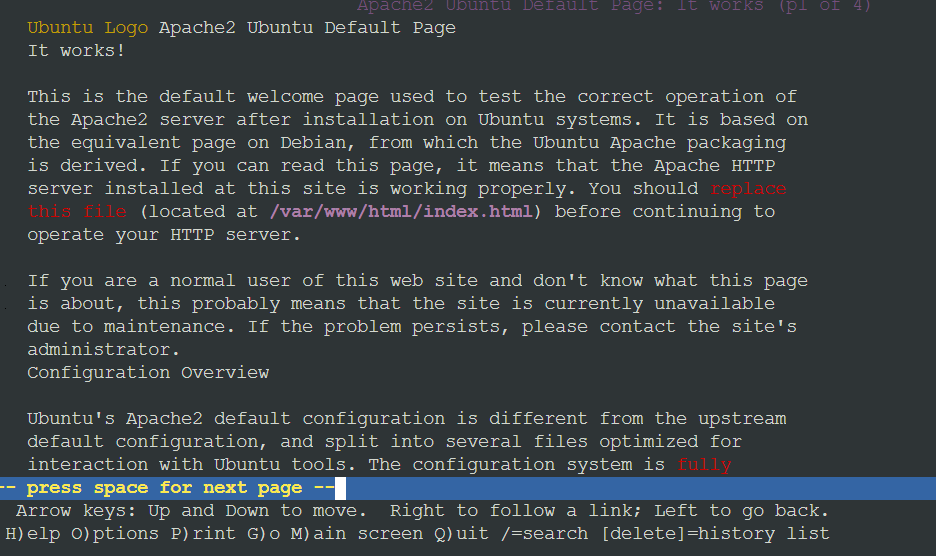
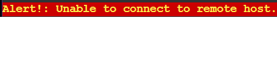

# Jarkom-Modul-3-ITA06-2022

## <b> Anggota Kelompok: </b>
1. Anisah Farah Fadhilah - 5027201023
2. Banabil Fawazaim Muhammad - 5027201055
3. Shafira Khaerunnisa - 5027201072
---


## Soal 3, 4, 5, dan 6
Loid dan Franky menyusun peta tersebut dengan hati-hati dan teliti.

Ada beberapa kriteria yang ingin dibuat oleh Loid dan Franky, yaitu:

1. Semua client yang ada HARUS menggunakan konfigurasi IP dari DHCP Server.
2. Client yang melalui Switch1 mendapatkan range IP dari [prefix IP].1.50 - [prefix IP].1.88 dan [prefix IP].1.120 - [prefix IP].1.155 (3)
3. Client yang melalui Switch3 mendapatkan range IP dari [prefix IP].3.10 - [prefix IP].3.30 dan [prefix IP].3.60 - [prefix IP].3.85 (4)
4. Client mendapatkan DNS dari WISE dan client dapat terhubung dengan internet melalui DNS tersebut. (5)
5. Lama waktu DHCP server meminjamkan alamat IP kepada Client yang melalui Switch1 selama 5 menit sedangkan pada client yang melalui Switch3 selama 10 menit. Dengan waktu maksimal yang dialokasikan untuk peminjaman alamat IP selama 115 menit. (6)

### Penyelesaian soal 3, 4, 5, dan 6
Kami membuat konfigurasi pada `/etc/dhcp/dhcpd.conf` di node **Westalis** sebagai berikut
```
ddns-update-style none;

option domain-name "example.org";
option domain-name-servers ns1.example.org, ns2.example.org;

default-lease-time 600;
max-lease-time 7200;

log-facility local7;

subnet 192.212.2.0 netmask 255.255.255.0{
}
subnet 192.212.1.0 netmask 255.255.255.0 {
   range 192.212.1.50 192.212.1.88;         # penyelesaian soal 3
   range 192.212.1.120 192.212.1.155;       # penyelesaian soal 3
   option routers 192.212.1.1;
   option broadcast-address 192.212.1.255;
   option domain-name-servers 192.212.2.2;  # IP WISE   # penyelesaian soal 5
   default-lease-time 300;                  # penyelesaian soal 6
   max-lease-time 6900;                     # penyelesaian soal 6
}
subnet 192.212.3.0 netmask 255.255.255.0 {
   range 192.212.3.10 192.212.3.30;         # penyelesaian soal 4
   range 192.212.3.60 192.212.3.85;         # penyelesaian soal 4
   option routers 192.212.3.1;
   option broadcast-address 192.212.3.255;
   option domain-name-servers 192.212.2.2;  # IP WISE   # penyelesaian soal 5
   default-lease-time 600;                  # penyelesaian soal 6
   max-lease-time 6900;                     # penyelesaian soal 6
}
```

dan konfigurasi pada `/etc/bind/named.conf.options` di node **WISE** sebagai berikut agar client dapat terhubung ke internet (penyelesaian soal 5)
```
options {
        directory "/var/cache/bind";
        forwarders {
                192.168.122.1;
        };
        allow-query{any;};
        auth-nxdomain no;
        listen-on-v6 { any; };
};
```

**Testing**


## Soal 7
Loid dan Franky berencana menjadikan Eden sebagai server untuk pertukaran informasi dengan alamat IP yang tetap dengan IP [prefix IP].3.13

### Penyelesaian soal 7
Kami menambah konfigurasi pada `/etc/dhcp/dhcpd.conf` di node **Westalis** sebagai berikut agar IP Eden tetap
```
host Eden {
    hardware ethernet 26:88:e7:9e:2d:08;
    fixed-address 192.212.3.13;
}
```

dan menambah konfigurasi pada `/etc/network/interfaces` (network configuration) di node **Eden** sebagai berikut agar hwaddress Eden tidak berganti saat project GNS3 dimatikan atau diexport.
```
hwaddress ether 26:88:e7:9e:2d:08
```

**Testing**


### Soal 8

 **SSS**, **Garden, dan Eden** digunakan sebagai client **Proxy** agar pertukaran informasi dapat terjamin keamanannya, juga untuk mencegah kebocoran data.

Pada Proxy Server di **Berlint,** Loid berencana untuk mengatur bagaimana Client dapat mengakses internet. Artinya setiap client harus menggunakan Berlint sebagai HTTP & HTTPS proxy. Adapun kriteria pengaturannya adalah sebagai berikut:

---

1. Client hanya dapat mengakses internet diluar (selain) hari & jam kerja (senin-jumat 08.00 - 17.00) dan hari libur (dapat mengakses 24 jam penuh)
2. Adapun pada hari dan jam kerja sesuai nomor (1), client hanya dapat mengakses domain loid-work.com dan franky-work.com (IP tujuan domain dibebaskan)
3. Saat akses internet dibuka, client dilarang untuk mengakses web tanpa HTTPS. (Contoh web HTTP: [http://example.com](http://example.com/))
4. Agar menghemat penggunaan, akses internet dibatasi dengan kecepatan maksimum 128 Kbps pada setiap host (Kbps = kilobit per second; lakukan pengecekan pada tiap host, ketika 2 host akses internet pada saat bersamaan, **keduanya mendapatkan speed maksimal yaitu 128 Kbps**)
5. Setelah diterapkan, ternyata peraturan nomor (4) mengganggu produktifitas saat hari kerja, dengan demikian pembatasan kecepatan hanya diberlakukan untuk pengaksesan internet pada hari libur

Setelah proxy **Berlint** diatur oleh Loid, dia melakukan pengujian dan mendapatkan hasil sesuai tabel berikut.

| Aksi | Senin (10.00) | Senin (20.00) | Sabtu (10.00) |
| --- | --- | --- | --- |
| Akses internet (HTTP) | x | x | x |
| Akses internet (HTTPS) | x | v | v |
| Akses loid-work.com dan franky-work.com | v | x | x |
| Speed limit (128Kbps) | tidak bisa akses | x (speed tidak dibatasi) | v |

x: tidak

v: iya

### Penyelesaian Soal 8

Konfigurasi domain:

Ditambahkan konfigurasi domain [*loid-work.com*](http://loid-work.com) dan [*franky-work.com](http://franky-work.com)* di DNS server yaitu WISE

```bash
echo "
zone \"loid-work.com\" {
        type master;
        file \"/etc/bind/jarkom/loid-work.com\";
};
zone \"franky-work.com\" {
        type master;
        file \"/etc/bind/jarkom/franky-work.com\";
};
"> /etc/bind/named.conf.local
```

Menambahkan domain

```bash
echo "
;
; BIND data file for local loopback interface
;
\$TTL    604800
@       IN      SOA     franky-work.com. root.franky-work.com. (
                              2         ; Serial
                         604800         ; Refresh
                          86400         ; Retry
                        2419200         ; Expire
                         604800 )       ; Negative Cache TTL
;
@               IN      NS      franky-work.com.
@               IN      A       192.212.2.2     ; IP WISE
www             IN      CNAME   franky-work.com.
" > /etc/bind/jarkom/franky-work.com

echo "
;
; BIND data file for local loopback interface
;
\$TTL    604800
@       IN      SOA     loid-work.com. root.loid-work.com. (
                              2         ; Serial
                         604800         ; Refresh
                          86400         ; Retry
                        2419200         ; Expire
                         604800 )       ; Negative Cache TTL
;
@       IN      NS      loid-work.com.
@       IN      A       192.212.2.2     ; IP WISE
www     IN      CNAME   loid-work.com.
" > /etc/bind/jarkom/loid-work.com
```

Memberikan konfigurasi masing-masing domain

```bash
echo '
<VirtualHost *:80>
        ServerAdmin webmaster@localhost
        DocumentRoot /var/www/html
        ServerName loid-work.com
 
        ErrorLog ${APACHE_LOG_DIR}/error.log
        CustomLog ${APACHE_LOG_DIR}/access.log combined
</VirtualHost>
' > /etc/apache2/sites-available/loid-work.com.conf

echo '
<VirtualHost *:80>
        ServerAdmin webmaster@localhost
        DocumentRoot /var/www/html
        ServerName franky-work.com
 
        ErrorLog ${APACHE_LOG_DIR}/error.log
        CustomLog ${APACHE_LOG_DIR}/access.log combined
</VirtualHost>
' > /etc/apache2/sites-available/franky-work.com.conf
```

Memberikan Konfigurasi web agar bisa dicek melalui client proxy dengan lynx

Konfigurasi Proxy:

1. Membatasi akses client dengan hanya bisa mengakses internet pada diluar jam kerja yaitu senin sampai jumat jam 08.00 sampai 17.00 

Mendeklarasikan waktu kerja dan diluar kerja, kemudian memberikan hak akses diluar jam kerja
    
    ```bash
    acl WORKTIME time MTWHF 08:00-17:00
    acl WEEKEND time SA 00:00-23:59
    ```
    
    ```bash
    http_access allow !WORKTIME
    http_access deny all
    ```
    
2. Hanya bisa mengakses domain kerja (**loid-work.com & franky-work.com**) pada saat jam kerja

Mendeklarasikan sejumlah domain kerja dan memberikan hak akses pada saat jam kerja
    
    ```bash
    echo '
    loid-work.com
    franky-work.com
    ' > /etc/squid/work-sites.acl
    
    acl WORKSITE dstdomain "/etc/squid/working-sites.acl"
    ```
    
    ```bash
    http_access allow WORKSITE WORKTIME
    ```
    
3. Hanya memperbolehkan HTTPS (tidak boleh melalui HTTP)

Mengingat port HTTPS adalah 443, maka kita deklarasikan terlebih dahulu portnya lalu melarang semua akses yang tidak melewati port 443 
    
    ```bash
    acl GOODPORT port 443
    acl CONNECT method CONNECT
    ```
    
    ```bash
    http_access deny !GOODPORT
    http_access deny CONNECT !GOODPORT
    ```
    
4. Pembatasan kecepatan internet menjadi 128Kbps

Mengubah parameter internet menjadi 16000/16000 dimana itu membatasi kecepatan internet menjadi 128Kbps
    
    ```bash
    delay_pools 1
    delay_class 1 1
    delay_parameters 1 16000/16000
    ```
    
5. Pembatasan dilakukan hanya pada saat hari sabtu dan minggu

kita menambahkan konfigurasi bandwidth menjadi berkut
    
    ```bash
    delay_pools 1
    delay_class 1 1
    delay_access 1 allow WEEKEND_TIME
    delay_parameters 1 16000/16000
    ```
    

Setelah konfigurasi dimasukan maka akan didapatkan 2 hasil:

jika berhasil mengakses



jika gagal mengakses


